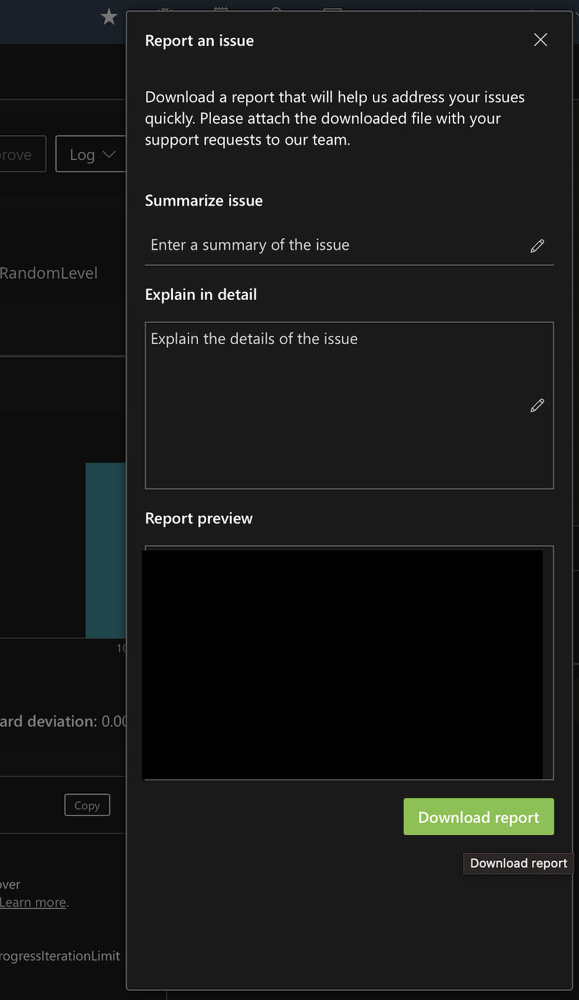
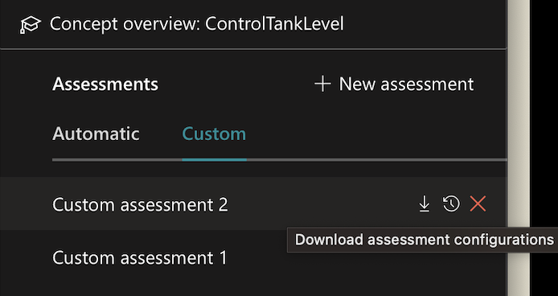

# Downloading Your Data From Bonsai

In light of the retirement of the Bonsai service, you may want to download your data from the platform before it goes offline. To help you with this process, below are some tips for downloading your data using the [Bonsai Web UI](https://preview.bons.ai/) and [CLI](https://learn.microsoft.com/en-us/bonsai/cli/?tabs=windows). 

This document covers how to export:
- [Bonsai Reports](#bonsai-reports)
- [Brain Names, Versions, and Timestamps](#brain-names-versions-and-timestamps)
- [Custom Assessments](#custom-assessments)
- [Errors and Outputs](#errors-and-outputs)
- [Exported Brains](#exported-brains)
- [Inkling](#inkling)
- [Reward Training Graph](#reward-training-graph)
- [Simulator Information](#simulator-information)
- [Simulators](#simulators)


## Bonsai Reports 

Bonsai reports are unique for each brain name & version. This report will aggregate most of the configuration you care about for each brain version including Brain Name, Brain Version, and Inkling File.

Open the [Bonsai Web UI](https://preview.bons.ai/), and navigate to the brain version you would like to download. On the top left banner of the Bonsai UI, you can download your Bonsai report by choosing the "Report an Issue" button that looks like a bug.


Once you select this button, a screen will come up that will allow for you to download your Brain's Bonsai Report. Select the "Download report" button and you will download a zip file with your Brain's data.



The downloaded zip file contains the following three relevant files:

- **brain_messages.json**: Brain training progress updates displayed in the "Errors & Outputs" brain tab.
- **inkling.ink**: Inkling file with your training configuration.
- **overview.txt**: Identifiers for the brain including Workspace Name & ID, Subscription ID, Resource Group, Brain Name & Version.

Three other files will be available at the folder, but they are likely less useful for safe-keeping purposes: browser_console_logs.txt, network_errors.json, and resource_timing.json.


## Brain Names, Versions, and Timestamps

You can retrieve a list of all Bonsai Brain Names by running this command in the CLI:

```
bonsai brain list -w $workspace_id
```


## Custom Assessments

**Assessment Config File:**

To save Custom Assessments, open the Bonsai Web UI. Then, select the Brain and Brain Version with the custom assessments you would like to save. Click on the "Train" tab next to your brain name/version. Look for your assessments on the far right of the webpage, under the Concept overview section. Click on the Custom tab under Assessments to choose which Custom Assessment you would like to download.



Click on the download button to get your Custom Assessment Configuration as a `.json` file. 

**Assessment Episodic Data:**

Click on your Custom Assessment to load it in the UI. Then, click on the `Episode data` tab, under your custom assessments metadata, to load your custom assessment episodic data.

*Note, data in Azure is cleaned to prevent extra costs after 30 days by default. If you see your Episode Data has expired, you can click on "Rerun Assessment" to launch a new custom assessment, and be able to load the Episodic Data for the same Configuration file.*

Once you have your Custom Assessment Episodic Data visible in the `Episode data` tab, you can click on the link to access and download your Custom Assessment Episodic Data from Log Analytics directly.


## Errors and Outputs

**Option 1 (recommended):**

Access your Errors & Outputs directly from the Bonsai Report we downloaded above. You will find them inside the downloaded ZIP file under the name `brain_messages.json`.

**Option 2:**

Errors and Outputs can be copied and saved directly from the Bonsai Web UI. After selecting a Brain, look to the lower middle of your screen below the Inkling training console where you will see the "Errors and Outputs" console. On the left side of the console, you have the option to copy the Error and Outputs report to your clipboard. Save this to a .txt file for future use. 

The Error and Outputs console looks like this:


## Exported Brains

Once a Brain has been satisfactorily trained, you can export your Brain, saving it in ACR. 

To save and export your Brain:

```
bonsai exportedbrain create     \
  --name "$exported_brain_name"           \
  --brain-name "$brain_name"       \
  --processor-architecture x64  \
  --brain-version $version             \
  --display-name "$display_name"
```

To get the location of your exported Brain, use the CLI:

```
bonsai exportedbrain show --name "$exported_brain_name"
```


## Inkling

There are three options to download your Inkling code from Bonsai. 

**Option 1 (recommended):**

Access your Inkling file directly from the Bonsai Report we downloaded above. You will find them inside the downloaded ZIP file under the name `inkling.ink`.

**Option 2:**

Copy and paste the code from your Inkling file within each Brain into a file on your local computer. 
 
**Option 3:**

Use the CLI command to save the inkling to a file: 

```
bonsai brain version get-inkling \
  --name '$name'              \
  --version $brainversion
  --file $outputinklingfilename
```

**Final Considerations:**

If your training graph is complex, we recommend you take a screenshot of your concept graph and store it along your other Brain Version files too. Understanding the flow of information and interaction between concepts can be hard from the Inkling file alone.


## Reward Training Graph

The reward training graph can be accessed directly from the brain version. First, click on the Train tab, for the brain version of interest. Then, if using Goals, right-click on the legend on the upper-right corner of the graph. In the menu, select "Show Rewards" to plot the evolution of rewards throughout the training session. Take a screenshot of that graph, and save the image along with your Bonsai Report and/or Exported Brain docker image.


## Simulator Information

To retrieve the list of managed simulators associated with your Bonsai workspace, type the following into the CLI:

```
bonsai simulator package list
```

You can use the following command to retrieve the list of unmanaged simulators, although your list should be empty if you are not actively training any brains:

```
bonsai simulator unmanaged list
```


## Simulators

When downloading your managed Simulators, you should be able to download them from ACR. In the event that you are unsure of where your Simulator is located, you can get your Sim's configuration details using the following command in the CLI:

```
bonsai simulator package show \
    --name '$sim_name'
```

The above command will retrieve the sim attributes, including `ACR Uri`. Save this name somewhere before you continue.

To download your packaged simulation as a docker file for safe-keeping purposes, first, visit the Azure Portal. Then, find your Bonsai Workspace. Within the `Overview tab`, click on the `Registry` object. On the left pane of your Registry, click on `Repositories` (under the Services section) to open the list of simulations. In the list, find the name corresponding to the `ACR Uri` tag you saved from the CLI before.

These commands can also be used to get your **Simulator Environment Configurations**. Be sure to save this information. 
