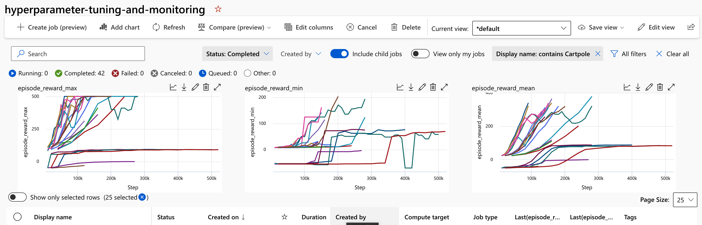

# Logging Metrics and Monitoring Experiments with MLFlow

## Overview


The Plato toolkit integrates with MLFlow for monitoring experiments, saving model checkpoints, and logging metrics. This integration allows you to view your model's training progress over time, view and download snapshots of your model over time, and compare multiple runs together.

This sample `examples/hyperparameter-tuning-and-monitoring` shows how to use the MLFlow integration with Plato. This example uses the `MLflowLoggerCallback` from Ray Tune to log the results to MLflow. The MLflow integration allows you to log all the artifacts produced by Ray Tune, such as the model checkpoints, to MLflow.

For more information on available options and customizations, see the [documentation](https://docs.ray.io/en/releases-2.3.1/tune/api/doc/ray.air.integrations.mlflow.MLflowLoggerCallback.html#ray.air.integrations.mlflow.MLflowLoggerCallback) for the callback.

## How Logging is Setup in the Sample

The sample uses [`ray.air.RunConfig`](https://docs.ray.io/en/releases-2.3.0/ray-air/api/doc/ray.air.RunConfig.html) for configuring training and tuning runs. This is where we provide the callback for `mlflow` and ask it to save model checkpoints and metrics.

```python
run_config=air.RunConfig(
    stop=stopping_criteria,
    callbacks=[
        MLflowLoggerCallback(
            tags={MLFLOW_PARENT_RUN_ID: current_run.info.run_id},
            experiment_name="pbt_ppo",
            save_artifact=True,
        )
    ],
)
```

Here we are setting up a tag to ensure all the subsequent sweeping jobs are run under the same parent job, making it easier to view the results on AzureML. Additionally, we ask MLflow to save all the artifacts produced by Ray Tune, which includes the hyperparameter values and model checkpoints.

### Viewing Local Runs using the MLFlow UI

If you use the `--test-local` option when running the sample, your results will be saved locally in a folder called `mlruns`.

```bash
mlruns
├── 0
│   ├── 9fcea3f4faf845a3be62c60bfdd24f30
│   │   ├── artifacts
│   │   ├── meta.yaml
│   │   ├── metrics
│   │   ├── params
│   │   └── tags
│   │       ├── mlflow.source.git.commit
│   │       ├── mlflow.source.name
│   │       ├── mlflow.source.type
│   │       └── mlflow.user
│   └── meta.yaml
└── 1
    ├── c0844d850fef427c8d861ad5f4cd7fdd
    │   ├── artifacts
    │   │   ├── checkpoint_000010
    │   │   │   ├── algorithm_state.pkl
    │   │   │   ├── policies
    │   │   │   │   └── default_policy
    │   │   │   │       ├── policy_state.pkl
    │   │   │   │       └── rllib_checkpoint.json
    │   │   │   └── rllib_checkpoint.json
    │   │   ├── params.json
    │   │   ├── params.pkl
    │   │   ├── progress.csv
    │   │   └── result.json
    │   ├── meta.yaml
    │   ├── metrics
    │   │   ├── agent_timesteps_total
    │   │   ├── done
    │   │   ├── episode_len_mean
    │   │   ├── episode_reward_max
    │   │   ├── episode_reward_mean
    │   │   ├── episode_reward_min
    │   │   ├── episodes_this_iter
    │   │   ├── episodes_total
    │   │   ├── iterations_since_restore
    │   │   ├── num_agent_steps_sampled
    │   │   ├── num_agent_steps_trained
    │   │   ├── num_env_steps_sampled
    │   │   ├── num_env_steps_sampled_this_iter
    │   │   ├── num_env_steps_trained
    │   │   ├── num_env_steps_trained_this_iter
    │   │   ├── num_faulty_episodes
    │   │   ├── num_healthy_workers
    │   │   ├── num_in_flight_async_reqs
    │   │   ├── num_remote_worker_restarts
    │   │   ├── num_steps_trained_this_iter
    │   │   ├── pid
    │   │   ├── time_since_restore
    │   │   ├── time_this_iter_s
    │   │   ├── time_total_s
    │   │   ├── timestamp
    │   │   ├── timesteps_since_restore
    │   │   ├── timesteps_total
    │   │   ├── training_iteration
    │   │   └── warmup_time
    │   ├── params
    │   │   ├── clip_param
    │   │   ├── env
    │   │   ├── kl_coeff
    │   │   ├── lambda
    │   │   ├── lr
    │   │   ├── num_cpus
    │   │   ├── num_gpus
    │   │   ├── num_sgd_iter
    │   │   ├── num_workers
    │   │   ├── sgd_minibatch_size
    │   │   └── train_batch_size
    │   └── tags
    │       ├── mlflow.parentRunId
    │       ├── mlflow.runName
    │       └── trial_name
    └── meta.yaml
```

You can launch a local UI for mlflow by running

```bash
mlflow ui
```

from the samples directory. Here you can view model checkpoints and a table summary of all the runs.


### Viewing Remote Runs on AzureML

If you instead ran these experiments on AzureML remotely, you should use the AzureML Studio to view your experiments.

#### Viewing Job Runs and Filtering Your Experiment

If you navigate to your AML workspace and click on the jobs tab, you should see all the experiments you have run. By default, AML will only show the parent jobs, which does not include the jobs that run the actual hyperparameter sweeps. To view all the jobs, you can click on the "Include child jobs" button at the top of the screen. You can then filter based on time to view the most recent runs, or by experiment name to see the ones relevant to your specific experiment. The charts will also be automatically updated based on your filter.

Some useful filters you can run:

1. Filter on `episode_reward_mean` to the highest value or above a certain threshold. This can help you identify the models that perform the best.
2. Filter on `agent_timesteps_total` to see the models that have been trained for the longest amount of sample steps.
3. Filter on `time_total_s` to see the models that have been trained for the longest amount of time.
4. Filter on job status to see the jobs that have completed successfully, are still running or have failed.


#### Adding Custom Charts

If you want to change the default charts that are displayed for your experiments in AzureML Studio, you can create a custom chart and save it as the default.

To do this, you can follow these steps:

Open your experiment in AzureML Studio.

- Click on the "Charts" tab to view the default charts.
- Create a new chart by clicking on the "New Chart" button.
- Configure the chart to display the metric(s) that you want to be the default, such as `episode_reward_mean`.
- Once you are satisfied with the chart, click on the "Save as Default" button at the bottom of the screen.
- After you have saved your custom chart as the default, it should be displayed automatically whenever you open your experiment in AzureML Studio.
  - Note that this will only affect your own view of the experiment; other users will still see the original default charts unless they also create and save their own custom charts.




### Downloading Checkpoints From AML Registry

After you have completed your training jobs, you can download the checkpoints from the AML registry to your local machine. This can be useful if you want to run inference on your model locally or deploy it to a different environment. The script `get_mlflow_artifacts.py` provides some helper functions for downloading the top-performing checkpoint from your AML experiments to your local machine. Specifically, the following code chunk will download the top checkpoint from the most recent experiment to the `model_checkpoints` directory. If you want to download from a different experiment, you can change the `experiment` variable to the name of the experiment you want to download from (you can use something like `[a.name for a in experiments]` to view each experiment by its name)

```python
from get_mlflow_artifacts import get_top_run, list_experiments
experiments = list_experiments()
# pick the experiment you run
experiment = experiments[-1].name
local_path = "model_checkpoints"
get_top_run(experiment, local_path, rank_metric="metrics.episode_reward_max")
```

Note the argument `rank_metric` for the `get_top_run` function. This argument specifies which metric to use to rank the checkpoints. By default, it is set to `metrics.episode_reward_mean`, which will rank the checkpoints by the average episode reward. You can change this to any of the other metrics that are logged by the training script, such as `metrics.episode_reward_max` or `metrics.episode_reward_min`. You can also change the `local_path` argument to specify a different directory to download the checkpoints to.
