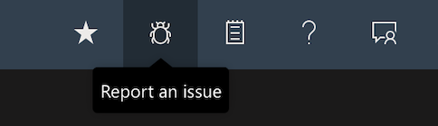
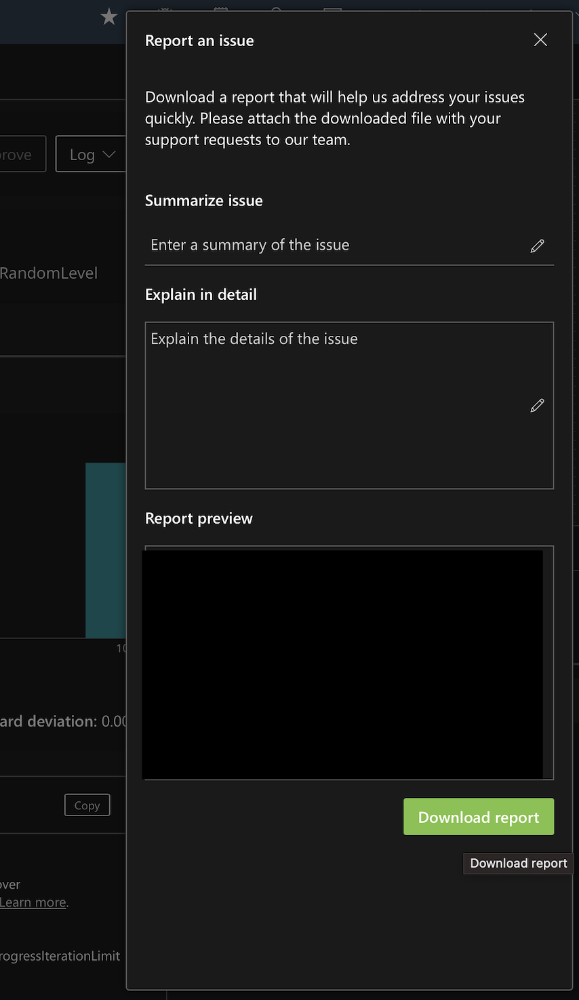
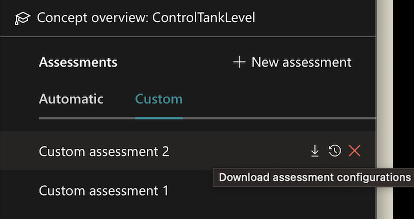
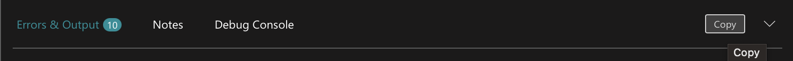

# Removing Data From Bonsai

To prepare for migration off of Bonsai, it may be beneficial to remove the data from your trained Brains before Bonsai goes offline. To help you with this process, below are some tips for removing your data using the Bonsai UI and [CLI](https://learn.microsoft.com/en-us/bonsai/cli/?tabs=windows). 

This document covers how to remove the following data from Bonsai:

- [Bonsai Reports](#bonsai-reports)
- [Brain Names, Versions, and Timestamps](#brain-names-versions-and-timestamps)
- [Custom Assessments](#custom-assessments)
- [Errors and Outputs](#errors-and-outputs)
- [Exported Brains](#exported-brains)
- [Inkling](#inkling)
- [Simulator List](#simulator-list)
- [Simulators](#simulators)


## List and Description of Removable Data 

### Bonsai Reports 

On the top left banner of the Bonsai UI, you can download your Bonsai report by choosing the "Report an Issue" button that looks like a bug. 




Once you select this button, a screen will come up that will allow for you to download your Brain's Bonsai Report. Select this button and you will receive a zip file with your Brain's messages, console logs, **Inkling file**, network errors, overview, resource timing and **Settings**. 





### Brain Names, Versions, and Timestamps

You can retrieve Bonsai Brain names and versions by using this command in the CLI:

```
bonsai brain list -w $workspace_name
```


### Custom Assessments

To save Custom Assessments, open the Bonsai UI, select the Brain and Brain Version with the custom assessments you would like to save, and look to the far left of the webpage under the Concept overview section. Click on the Custom tab under Assessments to choose which Custom Assessment you would like to download. 



Click on the download button to get your Custom Assessment as a `.json` file. 

### Errors and Outputs

Errors and Outputs can be copied and saved from the Bonsai UI. After selecting a Brain, look to the lower middle of your screen below the Inkling training console where you will see the "Errors and Outputs" console. On the left side of the console, you have the option to copy the Error and Outputs report to your clipboard. Save this to a .txt file for future use. 

The Error and Outputs console looks like:



### Exported Brains

Once a Brain has been satisfactorily trained, you can export your Brain, saving it in ACR. 

To save and export your Brain:

```
bonsai exportedbrain create     \
  --name "$exported_brain_name"           \
  --brain-name "$brain_name"       \
  --processor-architecture x64  \
  --brain-version $version             \
  --display-name "$display_name"
```

To get the location of your exported Brain, use the CLI:

```
bonsai exportedbrain show --name "$exported_brain_name"
```

### Inkling

There are two options to remove your Inkling code from Bonsai. 

**Option 1:**

Copy and paste the code from your Inkling file within each Brain into a file on your local computer. 
 
**Option 2:**

Use the CLI command: 

```
bonsai brain version get-inkling \
  --name '$name'              \
  --version $brainversion
```


### Simulator List

To retrieve the list of managed simulators associated with your Bonsai workspace, type the following into the CLI:

```
bonsai simulator package list
```

To retrieve the list of unmanaged simulators associated with your Bonsai workspace, you will use this command instead of the above:

```
bonsai simulator unmanaged list
```

### Simulators

When removing your managed Simulators, you should be able to remove them from ACR. In the event that you are unsure of where your Simulator is located, you can get your Sim's configuration details using the following in the CLI:

```
bonsai simulator package show \
    --name '$sim_name'
```

To get the information for unmanaged Simulators for retrieval, you will need your Session_ID. This imformation can be found by using the unmanaged simulator list command shown in the **Simulator list** section. Once you have the Session_ID, you will use this command to find the location of your unmanaged Sim:

```
bonsai simulator unmanaged show –-session-id $session_id
```

These commands can also be used to get your **Simulator Environment Configurations**. Be sure to save this information. 


## Prioritizing What to Remove 

Downloading your Brain's Bonsai Report is the quickest way to remove most of the data you need from the Bonsai platform. It includes your Brain's messages, console logs, inkling file, network errors, overview, resource timing and settings information. 

Once that has been downloaded, consider what other information would be beneficial to you as you migrate to Azure Machine Learning. 
