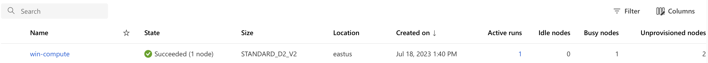

## Running Windows OS on Azure Machine Learning Studio

Azure Machine Learning Studio (AML) does not currently have native support of Windows OS container hosting. Due to this, sim that are containerized using Windows OS have to follow different procedures when training your model on the AML platform. Below is a description of the path you have to take to run a Windows OS containerized sim on AML. 

### Preparing Your DockerFile

When preparing your Dockerfile, you **must** use an Windows base image tag that uses OSVersion, `10.0.17763.4737`. In our proof of concept demonstration, we use the Windows servercore:ltsc2019 base image tag. You can find more information on which base image tags use OSVersion `10.0.17763.4737` on the [Windows Servercore Resources Page](https://hub.docker.com/_/microsoft-windows-servercore).

### Pushing to ACR

Because AML does not natively support Windows OS containers, using the AML service to containerize your sim will fail. AML's docker daemon only reads from a Linux manifest. To get around this, you can push your container to the Azure Container Registry (ACR) service. When pushing your Windows OS Container to ACR, be sure to use the `--platform windows` command in the CLI to ensure the Windows manifest is being read by the docker daemon containerizing your image. 

To push your container to ACR, run the following code in your CLI.

````
az acr build --image $imagename --registry $registryname --file Win_Dockerfile --platform windows
````

### Creating Windows OS Based Compute Clusters

You will have to create a compute cluster running on Windows OS for your container hosting your sim to run. To do this, upload the ``windows_compute.ipynb`` to your AML workspace and run the notebook to create a Windows compute cluster. You can make adjustments to the code to increase the cluster's size to accommodate for larger training jobs. 

You must create this compute cluster before moving on to creating a Windows based environment. 

To find information about your Windows compute cluster, you can visit the "compute" tab by looking on the left side of AML's UI and selecting the option that looks like a desktop monitor like so 


### Creating a Windows OS Based Environment

Once you have pushed your containerized sim to ACR and created a Windows OS based compute cluster, you can create a Windows OS based environment to run your training job. Upload the ``windows_env.ipynb`` file to the same AML workspace with your compute cluster and run the notebook to create a Windows environment. 

Once the environment is created, your training job will show up in the "jobs" section found on the left side of AML's UI and represented by an experiment beaker. It looks like so 


When your Windows environment is successfully running on your compute cluster, the status of your compute cluster will show that your cluster is successfully running a job. 



